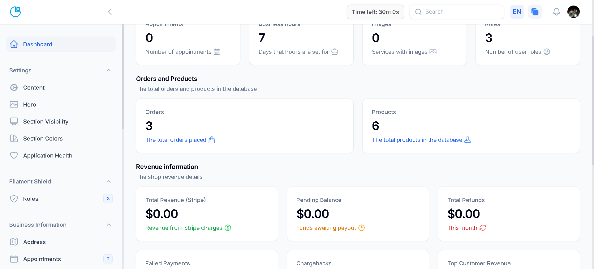

# WittyWorkflow

<div align="center">
  <a href="https://github.com/kristi11/wittyworkflow/">
    
  </a>

  <h1 align="center">Witty Workflow</h1>

  <p align="center">
    A powerful platform for managing your business built with the TALL stack
    <br />
    <br />
    <a href="#interactive-demo">🎮 Interactive Demo</a>
    ·
    <a href="https://github.com/kristi11/wittyworkflow/issues">🐛 Report Bug</a>
    ·
    <a href="https://github.com/kristi11/wittyworkflow/issues">✨ Request Feature</a>
  </p>

  
  
  
  
  
  

  
  
  
</div>

> **⚠️ This app is in active development**

> **⚠️ THIS REPOSITORY SHOULD BE USED ON A BRAND-NEW PROJECT**

<!-- TABLE OF CONTENTS -->

<details>
  <summary>📋 Table of Contents</summary>
  <ol>
    <li>
      <a href="#about-the-project">About The Project</a>
      <ul>
        <li><a href="#interactive-demo">Interactive Demo</a></li>
        <li><a href="#key-features">Key Features</a></li>
        <li><a href="#built-with">Built With</a></li>
        <li><a href="#use-cases">Use cases</a></li>
      </ul>
    </li>
    <li>
      <a href="#getting-started">Getting Started</a>
      <ul>
        <li><a href="#prerequisites">Prerequisites</a></li>
        <li><a href="#quickstart">Quickstart</a>
          <ul>
            <li><a href="#automated-setup-recommended">Automated Setup</a></li>
            <li><a href="#shield-setup-only">Shield Setup Only</a></li>
            <li><a href="#manual-setup-alternative">Manual Setup</a></li>
          </ul>
        </li>
        <li><a href="#troubleshooting">Troubleshooting</a></li>
        <li><a href="#email-configuration">Email Configuration</a></li>
      </ul>
    </li>
    <li>
      <a href="#command_list">Command list</a>
      <ul>
        <li><a href="#automated-setup-single-command">Automated Setup</a></li>
        <li><a href="#shield-setup-only-1">Shield Setup Only</a></li>
        <li><a href="#manual-setup-individual-commands">Manual Setup</a></li>
      </ul>
    </li>
    <li>
      <a href="#configuration">Configuration</a>
      <ul>
        <li><a href="#disabled-features">Disabled features</a></li>
        <li><a href="#side-note">Side note</a></li>
        <li><a href="#role-configuration">Role configuration</a></li>
        <li><a href="#role-explanation">Role explanation</a></li>
        <li><a href="#panel-switching">Panel switching</a></li>
        <li><a href="#adding-variants">Adding variants</a></li>
        <li><a href="#otp">One Time Passwords</a></li>
      </ul>
    </li>
    <li>
      <a href="#shop">Shop</a>
      <ul>
        <li><a href="#shop-architecture-overview">Shop Architecture Overview</a></li>
        <li><a href="#setting-up-the-shop">Setting Up the Shop</a>
          <ul>
            <li><a href="#1-stripe-integration">1. Stripe Integration</a></li>
            <li><a href="#2-database-configuration">2. Database Configuration</a></li>
          </ul>
        </li>
        <li><a href="#using-the-shop-system">Using the Shop System</a>
          <ul>
            <li><a href="#product-management">Product Management</a></li>
            <li><a href="#cart-functionality">Cart Functionality</a></li>
            <li><a href="#checkout-process">Checkout Process</a></li>
            <li><a href="#order-management">Order Management</a></li>
          </ul>
        </li>
        <li><a href="#testing-the-shop">Testing the Shop</a></li>
        <li><a href="#going-live">Going Live</a></li>
        <li><a href="#customizing-the-shop">Customizing the Shop</a></li>
      </ul>
    </li>
    <li>
      <a href="#appointment-management">Appointment Management</a>
      <ul>
        <li><a href="#appointment-system-architecture">Appointment System Architecture</a></li>
        <li><a href="#setting-up-appointments">Setting Up Appointments</a></li>
        <li><a href="#managing-appointments">Managing Appointments</a></li>
        <li><a href="#customizing-the-appointment-system">Customizing the Appointment System</a></li>
      </ul>
    </li>
    <li>
      <a href="#testing">Testing</a>
      <ul>
        <li><a href="#running-tests">Running Tests</a></li>
        <li><a href="#test-structure">Test Structure</a></li>
        <li><a href="#writing-new-tests">Writing New Tests</a></li>
      </ul>
    </li>
    <li>
      <a href="#customization-guide">Customization Guide</a>
      <ul>
        <li><a href="#theme-customization">Theme Customization</a></li>
        <li><a href="#extending-core-functionality">Extending Core Functionality</a></li>
        <li><a href="#common-customization-examples">Common Customization Examples</a></li>
      </ul>
    </li>
    <li>
      <a href="#deployment">Deployment</a>
      <ul>
        <li><a href="#server-requirements">Server Requirements</a></li>
        <li><a href="#deployment-steps">Deployment Steps</a></li>
        <li><a href="#platform-specific-guides">Platform-Specific Guides</a></li>
      </ul>
    </li>
    <li>
      <a href="#security">Security</a>
      <ul>
        <li><a href="#authentication-options">Authentication Options</a></li>
        <li><a href="#authorization-system">Authorization System</a></li>
        <li><a href="#security-best-practices">Security Best Practices</a></li>
        <li><a href="#data-protection">Data Protection</a></li>
      </ul>
    </li>
    <li>
      <a href="#performance">Performance Optimization</a>
      <ul>
        <li><a href="#caching-strategies">Caching Strategies</a></li>
        <li><a href="#database-optimization">Database Optimization</a></li>
        <li><a href="#asset-optimization">Asset Optimization</a></li>
        <li><a href="#monitoring-and-profiling">Monitoring and Profiling</a></li>
      </ul>
    </li>
    <li><a href="#usage">Usage</a></li>
    <li>
      <a href="#roadmap">Roadmap</a>
      <ul>
        <li><a href="#whats-next">What's next</a></li>
      </ul>
    </li>
    <li>
      <a href="#contributing">Contributing</a>
      <ul>
        <li><a href="#development-workflow">Development Workflow</a></li>
        <li><a href="#code-style-guidelines">Code Style Guidelines</a></li>
        <li><a href="#pull-request-process">Pull Request Process</a></li>
      </ul>
    </li>
    <li>
      <a href="#license">License</a>
      <ul>
        <li><a href="#what-this-means-for-developers">What this means for developers</a></li>
        <li><a href="#mit-license-summary">MIT License Summary</a></li>
        <li><a href="#useful-resources">Useful Resources</a></li>
      </ul>
    </li>
    <li><a href="#contact">Contact</a></li>
    <li><a href="#acknowledgments">Acknowledgments</a></li>
    <li>
      <a href="#known-issues">Known issues</a>
      <ul>
        <li><a href="#workaround">Workaround</a></li>
      </ul>
    </li>
  </ol>
</details>

<!-- ABOUT THE PROJECT -->

## 🚀 About The Project

WittyWorkflow is a TALL stack (Tailwind CSS, Alpine.js, Laravel, Livewire) foundation designed for building niche marketplaces and small business management tools. Whether you're crafting an e-commerce shop, managing appointments, or creating custom workflows, this modular platform—powered by Filament PHP—offers a robust starting point. It's built to be forked, extended, and deployed fast, with features like role-based dashboards, Stripe payments, and customizable UI out of the box.

Originally a demo app, WittyWorkflow has evolved into a versatile base for real-world projects. A prime example? It's being adapted into the Artisanal Food Production Manager—a marketplace example connecting artisanal producers to customers, complete with product listings, orders, and secure payments. Developers can use it as-is for small business needs or tailor it to specialized industries like handmade goods, local services, or boutique retail.

### 🎮 Interactive Demo

**Watch a guided tour of Witty Workflow's key features and intuitive interface.**

<a href="https://app.arcade.software/share/h1IWCpnFk0tsYB0N8bIz">
  
</a>

### ✨ Key Features

* 🌟 **Dynamic Hero:** Capture attention with a visually stunning, admin-customizable hero section—fully editable via Filament for a seamless experience.

* 🔐 **Role-Based Access:** Leverage Filament PHP for flexible, role-based dashboards—admins control all, team members and customers (e.g., producers/retailers) get tailored views, powered by Shield.

* ⚡ **SPA-Like Navigation:** Enjoy smooth transitions with Livewire's `wire:navigate`—enhances UX across panels and public pages.

* 📝 **Customizable Contact & Footer:** Boost engagement with a public email form and admin-editable footer for terms, help, or business details.

* 🛒 **E-commerce Module:** A TALL stack shop with Stripe integration, product management, and admin control—perfect for niches like artisanal food.

* 📅 **Appointment Management:** Schedule and manage appointments with email notifications—optional for service-based apps.

* 🔒 **Security Suite:** Protect accounts with 2-Factor Authentication (2FA) and One-Time Passwords (OTP)—toggleable for your needs.

* 🎨 **Theme Customization:** Tailor the app's look with admin-controlled themes and section visibility—swap styles without code.

* 🔄 **Section Positioning:** Control the order of public page sections through an intuitive admin interface—customize the user experience without touching code.

* 📊 **Application Health:** Monitor performance and server status with Spatie Laravel Health—actionable insights from the dashboard.

* ⚙️ **Business Settings:** Manage announcements, visibility, and niche-specific data—adaptable for any small business or marketplace.

* 🧰 **Developer Tools:** Demo seeds, and modular structure—fork and extend with ease.

<p align="right">(<a href="#about-the-project">back to top</a>)</p>

## 🛠️ Built With

This section lists all major frameworks/libraries used to bootstrap this project.

* Laravel 10.x
* Filament 3.x
* PHP 8.1


<p align="right">(<a href="#about-the-project">back to top</a>)</p>

### 💼 Use Cases

#### WittyWorkflow powers niche apps—here's how:

- **Artisanal Food Marketplace**: Producers list products, customers order, payments via Stripe.
- **Local Service Hub**: Book appointments for craftspeople, manage team schedules, customize the public page.
- **Boutique E-commerce**: Run a standalone shop with themed UI, secure logins, and order insights.
- **Creative Freelancer Platform**: Artists and designers showcase portfolios, clients request quotes.
- **Pop-up Event Manager**: Coordinate vendors, sell tickets.
- **Fitness Studio Management**: Schedule classes.

Fork it, tweak it—build your vision fast.

<!-- GETTING STARTED -->

## 🚀 Getting Started

Get WittyWorkflow running in minutes—perfect for prototyping or building your next niche app.

### 📋 Prerequisites

Before you begin, ensure your development environment meets these requirements:

- **PHP 8.1+** with the following extensions:
  - BCMath
  - Ctype
  - Fileinfo
  - JSON
  - Mbstring
  - OpenSSL
  - PDO
  - Tokenizer
  - XML
- **Composer 2.0+**
- **Node.js 16+** and NPM
- **MySQL 5.7+** or PostgreSQL 10+
- **Git**


#### ⚡ Quickstart

##### Automated Setup (Recommended)

WittyWorkflow provides convenient setup commands to automate the installation process:

1. Clone the repo and navigate to the project directory:
   ```bash
   git clone https://github.com/kristi11/ww-filament.git
   cd ww-filament
   ```

2. Run the automated setup command:
   ```bash
   php artisan app:setup
   ```

   This command will:
   - Install NPM and Composer dependencies
   - Create .env file from .env.example
   - Generate application key
   - Run database migrations with seeding
   - Set up Shield with proper permissions
   - Create storage link
   - Build assets

   **Available options:**
   - `--no-key`: Skip the key generation step
   - `--production`: Use npm run build instead of npm run dev (for production environments)

   After setup is complete, start the development server with:
   ```bash
   php artisan serve
   ```

3. Visit your application in the browser:
   ```
   http://localhost:8000
   ```

##### Shield Setup Only

If you need to set up just the Shield permissions system:

```bash
php artisan app:setup-shield
```

This command will:
- Run fresh migrations with seeding
- Set up Shield with proper permissions
- Generate Shield resources for the admin panel
- Set up the super admin user

##### Manual Setup (Alternative)

If you prefer to run commands individually or need more control over the setup process:

1. Clone the repo:
   ```bash
   git clone https://github.com/kristi11/ww-filament.git
   ```

2. Navigate to the project directory:
    ```bash
    cd ww-filament
    ```

3. Install NPM dependencies:
   ```bash
    npm install
   ```

4. Install the composer dependencies:
   ```bash
   composer install
   ```
5. Create a copy of your .env file:
   ```bash
    cp .env.example .env
   ```
6. Generate an app encryption key:
   ```bash
   php artisan key:generate
   ```

   > **Note:** If using Laravel [Forge](https://forge.laravel.com/), there's no need to generate a key since Forge handles key generation when creating the server.

7. Create an empty database for your application. We recommend using [TablePlus](https://tableplus.com/), but you can use any database management tool you prefer.

8. In the `.env` file, add database information to allow Laravel to connect to the database. The default database name is `ww_filament`. If you are using a different name, you'll need to edit the `DB_DATABASE` variable in the `.env` file with your database name.

9. Migrate and seed the database:
   ```bash
   php artisan migrate:fresh --seed
   ```
10. Set up Shield for user roles and permissions:
   ```bash
   php artisan shield:setup --fresh
   php artisan shield:generate --all --panel=admin
   ```

   Then define the super admin of the system:
   ```bash
   php artisan shield:super-admin --user="1"
   ```

   `--user=1` is the `id` of the user that will be the `super admin`. You can change it to whatever user you want to be the `super admin`.

11. Link the storage folder:
    ```bash
    php artisan storage:link
    ```
12. Run the application:
    ```bash
    php artisan serve
    ```
13. Visit your application in the browser:
    ```
    http://localhost:8000
    ```

14. Compile assets for development:
    ```bash
    npm run dev
    ```

### 📝 Command list

For quick reference, here are the commands to set up WittyWorkflow:

#### Automated Setup (Single Command)

```bash
# Complete setup with one command
php artisan app:setup

# Options:
# --no-key      Skip the key generation step
# --production  Use npm run build instead of npm run dev

# After setup, start the server with:
php artisan serve
```

#### Shield Setup Only

```bash
# Set up Shield permissions system only
php artisan app:setup-shield
```

#### Manual Setup (Individual Commands)

```bash
git clone https://github.com/kristi11/ww-filament.git .
npm install
composer install
cp .env.example .env
php artisan key:generate
php artisan migrate:fresh --seed
php artisan shield:setup --fresh
php artisan shield:generate --all --panel=admin
php artisan shield:super-admin --user="1"
php artisan storage:link
npm run dev
php artisan serve
```

### ❓ Troubleshooting

If you encounter issues during installation, here are solutions to common problems:

| Issue | Solution |
|-------|----------|
| **Class not found errors** | Run `composer dump-autoload` |
| **Node.js errors** | Ensure you're using Node.js 16+ with `node -v` |
| **Database connection errors** | Verify credentials in `.env` file |
| **Permission issues** | Check directory permissions, especially for storage and bootstrap/cache |
| **Blank page after installation** | Check PHP error logs and ensure all requirements are met |
| **Missing images/assets** | Run `php artisan storage:link` again |
| **Shield errors** | Run `php artisan optimize:clear` then retry Shield commands |

For more complex issues, check the [Laravel documentation](https://laravel.com/docs) or open an issue on our [GitHub repository](https://github.com/kristi11/wittyworkflow/issues).

### 📧 Email Configuration

> [!NOTE]
> Don't forget to update your Mail settings to reflect your production server's needs

For local email testing, we recommend [Mailtrap](https://mailtrap.io/). To use Mailtrap:

1. Create a Mailtrap account
2. Add your Mailtrap credentials to the `.env` file:

```
MAIL_MAILER=smtp
MAIL_HOST=smtp.mailtrap.io
MAIL_PORT=2525
MAIL_USERNAME=your_username
MAIL_PASSWORD=your_password
MAIL_ENCRYPTION=tls
MAIL_FROM_ADDRESS=your_email
MAIL_FROM_NAME="${APP_NAME}"
```

If you are using [Laravel Forge](https://forge.laravel.com/), you can add the credentials to the server environment variables.

<!-- SHOP -->

## 🛒 Shop

WittyWorkflow includes a fully-featured e-commerce system built with the TALL stack and integrated with Stripe for payment processing. This section will guide you through setting up and using the shop functionality.

### 🏗️ Shop Architecture Overview

The shop system consists of several key components:

- **Products & Variants**: Products can have multiple variants (size, color, etc.)
- **Cart System**: Manages items added to a user's cart
- **Checkout Process**: Integrated with Stripe for secure payments

### ⚙️ Setting Up the Shop

#### 1. Stripe Integration

First, add your Stripe credentials to your `.env` file:

```
STRIPE_KEY=your-stripe-key
STRIPE_SECRET=your-stripe-secret
STRIPE_WEBHOOK_SECRET=your-stripe-webhook-secret
```

##### Development Environment Setup

For local testing:

1. Install [stripe-cli](https://docs.stripe.com/stripe-cli)
2. Run `stripe login` to authenticate with your Stripe account
3. Start the webhook listener:
   ```
   stripe listen --forward-to {your-local-url}/stripe/webhook --format JSON
   ```
4. Copy the webhook signing secret provided by the CLI to your `.env` file as `STRIPE_WEBHOOK_SECRET`

##### Production Environment Setup

For production:

1. Run `php artisan cashier:webhook` on your server to register the webhook with Stripe
2. Go to the [Stripe Webhooks Dashboard](https://dashboard.stripe.com/webhooks)
3. Click on the newly created webhook
4. Copy the "Signing Secret" to your `.env` file as `STRIPE_WEBHOOK_SECRET`
5. Ensure the `checkout.session.completed` event is enabled:
   - Click the "..." button on the webhook
   - Choose "Update details"
   - Under "Events to send", click "Select events..."
   - Add `checkout.session.completed`

#### 2. Database Configuration

The shop system uses several database tables:

- `products`: Stores product information
- `product_variants`: Stores variant information for products
- `carts`: Manages user shopping carts
- `cart_items`: Stores items in carts
- `orders`: Tracks completed orders
- `order_items`: Stores items in orders

These tables are created automatically when you run migrations.

### 🛍️ Using the Shop System

#### Product Management

Products are managed through the Filament admin panel:

1. Navigate to the Products section in the admin panel
2. Create products with basic information (name, description, price, image)
3. Add variants for each product (size, color, etc.)

#### Cart Functionality

The cart system allows users to:

- Add products to their cart
- Update quantities
- Remove items
- View cart totals

The cart is implemented using the `Cart` and `CartItems` models, with the `AddProductVariantToCart` action handling the addition of products.

#### Checkout Process

The checkout process is handled by:

1. `CreateStripeCheckoutSession`: Creates a Stripe checkout session from the cart
2. `HandleCheckoutSessionCompleted`: Processes the completed checkout, creates an order, and clears the cart

#### Order Management

After checkout, orders are:

1. Created in the database with billing and shipping information
2. Associated with the user who made the purchase
3. Viewable in the admin panel for management

### 🧪 Testing the Shop

To test purchases in your development environment:

1. Use Stripe's test card number: `4242 4242 4242 4242`
2. Any future expiration date (e.g., `03/30`)
3. Any 3-digit CVC code (e.g., `123`)
4. Any name and address information

### 🚀 Going Live

To switch to production mode:

1. Complete your business profile in the [Stripe Dashboard](https://dashboard.stripe.com/settings/account)
2. Switch from test to live API keys in your `.env` file
3. Ensure your webhook is properly configured for the live environment
4. Test the complete purchase flow with a real card (consider using a small amount)

### 🔧 Customizing the Shop

The shop system is designed to be customizable:

- **Product Variants**: Add custom variants in `app/Enums/` and update the `ProductVariant` model
- **Checkout Flow**: Modify the `CreateStripeCheckoutSession` class to customize checkout options
- **Order Processing**: Extend the `HandleCheckoutSessionCompleted` class to add custom logic after purchase

See the [Adding Variants](#adding-variants) section for detailed instructions on customizing product variants.

<p align="right">(<a href="#about-the-project">back to top</a>)</p>

## ⚙️ Configuration

### **Disabled features:**

> [!IMPORTANT]
>
> #####  Switch the `canEdit()` function in `CRUDSettingsResource.php` to `true` ose `false` to enable or disable choosing whether the admin should be able to edit content or not.

### **Side note:**

#### If the `canCreate()`, `canEdit()` or `canDelete()` functions return anything other than a `true` or `false` value is best not to mess with that value because that value is supposed to be that way.

WittyWorkflow uses [filament-breezy](https://filamentphp.com/plugins/jeffgreco-breezy) to
manage user profiles. Change the following value to `shouldRegisterUserMenu: true/false` depending on your app's needs,
to `enable/disable` profile editing on `AdminPanelProvider.php` and `TeamPanelProvider.php` for the `Admin` and `Team member`
roles

```php
->myProfile(
    shouldRegisterUserMenu: false, // Sets the 'account' link in the panel User Menu (default = false)
    shouldRegisterNavigation: false, // Adds a main navigation item for the My Profile page (default = false)
    navigationGroup: 'Settings', // Sets the navigation group for the My Profile page (default = null)
    hasAvatars: false, // Enables the avatar upload form component (default = false)
    slug: 'profile' // Sets the slug for the profile page (default = 'my-profile')

)
->enableTwoFactorAuthentication(
    force: false, // force the user to enable 2FA before they can use the application (default = false)
)
```

### 👥 Role configuration

WittyWorkflow used the [Shield](https://filamentphp.com/plugins/bezhansalleh-shield)
package to manage roles as stated above. In order to give permissions to manage appointments go on the `Roles` section of the dashboard, inside the `Settings` sidebar menu group and for both `team_user` and `panel_user` choose `select all` on
the `Appointment` model permissions and to give the `panel_user` view permissions on the gallery choose  `view`
and `view any` under the `Gallery` model permissions. Also give the `panel_user` all permissions on the `Order` model permissions.

### 🔑 Role explanation

#### In order to use the Team role you need to create the role from the admin panel and the name of the role should be 'team_user' as it doesn't exist by default and then assign that role to a desired user. Multiple roles can be assigned to a user

* `super_admin` = The super admin of the system
* `team_user` = The team members of the system assigned by the Super Admin
* `panel_user` = The panel for the customers

### 🔄 Panel switching

> [!NOTE]
>
> In order to properly switch user panels for different roles the admin of the system must be assigned all the available roles (`super_admin`, `team_user` and `panel_user`) in the user resource. That way the admin will not be prompted with a `403` code when trying to access a panel that he doesn't have access to.

<!-- Adding variants -->

### 🔄 Adding variants

**There are quite a few steps you need to take to add/edit/delete variants, and I'll walk you through all of them:**

* Create migration to `add/edit/delete` database variants.
* Update the `ProductVariant.php` factory if needed. As of now only the `size` and `color` variants are assigned on the initial database seed just to keep things simple.
* Add the`Enum` for the newly created variant in `App/Enums`. To keep things simple, the enum can be named the same name as the database column, but you can name it whatever you want.
* Update the `getForm()` function in `ProductVariant.php` model, add/edit/delete the desired variants.
* Update the `$table` function in `ProductVariantResource.php`, add/edit/delete the desired variants.
* Update the `$table` function in `VariationsRelationManager.php`, add/edit/delete the desired variants.
* Add/Update/Delete the newly created Enum name inside `config/enums.php`.
* Update '$casts' on the `ProductVariant.php` model

**If the above steps have been implemented, your newly created variant is ready for use throughout the app.**

> [!NOTE]
>
> **The App comes preloaded with some general variants and some tech variants. You should add the variant types that fit the type of store you're building.**

<!-- One Time Passwords -->

> [!Important]
>
> OTP is now available for an extra added layer of security. To enable OTP just go to your desired panels and uncomment  `//FilamentOtpLoginPlugin::make(),`. The available panels are `AdminPanelProvider.php`, `CustomerPanelProvider.php` and `TeamPanelProvider.php`. If you're going to enable OTP is advisable to enable it on all panels but that depends on your app's needs.

<p align="right">(<a href="#about-the-project">back to top</a>)</p>

<!-- USAGE EXAMPLES -->

## 📅 Appointment Management

WittyWorkflow includes a comprehensive appointment scheduling system that integrates with email notifications and calendar systems.

### 🏗️ Appointment System Architecture

The appointment system consists of several key components:

- **Models**: `Appointment` and `Service` models manage the data structure
- **Booking Flow**: Users select services, available time slots, and complete bookings
- **Notifications**: Automatic emails for booking confirmation, reminders, and updates

### ⚙️ Setting Up Appointments

1. **Configure Business Hours**:
   - Navigate to the Business Hours section in the admin panel
   - Set your regular operating hours for each day of the week
   - Configure special hours for holidays or events

2. **Set Up Services**:
   - Create services that can be booked through the Services section
   - Define duration, price, and description for each service
   - Assign services to specific team members if needed

3. **Configure Email Templates**:
   - Customize email templates for appointment confirmations and reminders
   - Set up notification preferences for both staff and customers

### 📋 Managing Appointments

Appointments can be managed through the Filament admin panel:

1. **View Appointments**:
   - See all upcoming appointments in a calendar or list view
   - Filter by date, service, or status

2. **Create Appointments**:
   - Add appointments manually for walk-in customers

3. **Update Appointments**:
   - Reschedule appointments as needed
   - Change service or duration
   - Add notes or special requirements

4. **Cancel Appointments**:
   - Cancel with automatic notification to the customer
   - Optionally offer rebooking options

### 🔧 Customizing the Appointment System

The appointment system can be customized in several ways:

- **Booking Rules**: Modify booking rules in `app/Models/Appointment.php`
- **Email Templates**: Customize email templates in `resources/views/emails/appointments/`
- **Booking Form**: Extend the booking form in `resources/views/livewire/appointment-form.blade.php`

## 🧪 Testing

WittyWorkflow comes with a comprehensive test suite covering models, features, and integrations.

### 🏃‍♂️ Running Tests

```bash
# Run all tests
php artisan test

# Run specific test suite
php artisan test --testsuite=Feature

# Run specific test
php artisan test --filter=HeroTest
```

### 📁 Test Structure

- **Unit Tests**: Test individual components in isolation
- **Feature Tests**: Test complete features and user workflows
- **Browser Tests**: Test UI interactions using Laravel Dusk (if installed)

The test files are organized in the following directories:

- `tests/Unit/`: Unit tests for individual classes and methods
- `tests/Feature/`: Feature tests for complete functionality
- `tests/Feature/Models/`: Tests for model functionality

### ✍️ Writing New Tests

When adding new features, create corresponding tests in the appropriate directory:

- Model tests in `tests/Feature/Models/`
- Feature tests in `tests/Feature/`
- Browser tests in `tests/Browser/` (if using Dusk)

Example of a basic model test:

```php
/** @test */
public function it_can_create_a_model()
{
    $model = YourModel::factory()->create();
    $this->assertInstanceOf(YourModel::class, $model);
    $this->assertDatabaseHas('your_models', ['id' => $model->id]);
}
```

## 🎨 Customization Guide

WittyWorkflow is designed to be highly customizable without modifying core files.

### 🎭 Theme Customization

- **Colors**: Modify the color scheme in `tailwind.config.js`
- **Typography**: Change fonts and text styles in `resources/css/app.css`
- **Layouts**: Customize layouts in `resources/views/layouts/`

### 🧩 Extending Core Functionality

- **Custom Resources**: Add new Filament resources in `app/Filament/Resources/`
- **Custom Widgets**: Create dashboard widgets in `app/Filament/Widgets/`
- **Custom Fields**: Add custom form fields in `app/Forms/Components/`

### 📚 Common Customization Examples

1. **Adding a Blog**:
   - Create a Blog model and migration
   - Add a Filament resource for managing blog posts
   - Create public routes and views for displaying posts

2. **Custom User Roles**:
   - Extend the Shield configuration to add new roles
   - Define permissions for the new roles
   - Create role-specific dashboards or views

3. **Payment Gateway Integration**:
   - Add alternative payment methods beyond Stripe
   - Create payment gateway service classes
   - Integrate with checkout process

## 🚀 Deployment

### 🖥️ Server Requirements

- PHP 8.1+
- Nginx or Apache
- MySQL 5.7+ or PostgreSQL 10+
- Composer
- Node.js and NPM (for asset compilation)

### 📋 Deployment Steps

1. **Set up your web server and database**:
   - Configure Nginx/Apache with proper PHP settings
   - Create a database for your application

2. **Clone the repository to your server**:
   ```bash
   git clone https://github.com/kristi11/ww-filament.git /path/to/your/site
   ```

3. **Install dependencies**:
   ```bash
   composer install --no-dev --optimize-autoloader
   npm install && npm run build
   ```

4. **Set up environment variables**:
   - Copy `.env.example` to `.env`
   - Configure database, mail, and other settings
   - Generate application key: `php artisan key:generate`

5. **Run migrations**:
   ```bash
   php artisan migrate
   ```

6. **Set up task scheduling**:
   Add this to your crontab:
   ```
   * * * * * cd /path-to-your-project && php artisan schedule:run >> /dev/null 2>&1
   ```

7. **Configure caching**:
   ```bash
   php artisan config:cache
   php artisan route:cache
   php artisan view:cache
   ```

### 🌐 Platform-Specific Guides

- **Laravel Forge**: One-click deployment with automatic SSL
- **Digital Ocean**: Using the App Platform
- **AWS**: Deploying with Elastic Beanstalk

## 🔒 Security

WittyWorkflow implements multiple security features to protect your application and data.

### 🔐 Authentication Options

- **Standard email/password authentication**
- **Two-Factor Authentication (2FA)**
- **One-Time Password (OTP)**

### 🛡️ Authorization System

- **Role-based access control** via Filament Shield
- **Permission management** through the admin panel
- **Policy-based authorization** for fine-grained control

### 🔒 Security Best Practices

- Keep all dependencies updated
- Enable HTTPS in production
- Implement proper CORS policies
- Use environment variables for sensitive information

### 🔏 Data Protection

- User data is encrypted where appropriate
- Passwords are hashed using bcrypt
- CSRF protection is enabled for all forms
- XSS protection through proper output escaping

## ⚡ Performance Optimization

### 📦 Caching Strategies

- Enable Redis caching in `.env`: `CACHE_DRIVER=redis`
- Use model caching for frequently accessed data
- Implement view caching for complex templates

### 🗄️ Database Optimization

- Add indexes to frequently queried columns
- Use eager loading to prevent N+1 query issues
- Consider database table partitioning for large datasets

### 🚀 Asset Optimization

- Use production builds: `npm run build`
- Enable HTTP/2 on your web server
- Implement a CDN for static assets

### 📊 Monitoring and Profiling

- Use Laravel Telescope for development debugging
- Implement Laravel Horizon for queue monitoring
- Consider New Relic or Blackfire for production monitoring

## 🔍 Usage

To access the `super-admin dashboard, go to the [Super-admin dashboard](https://wittyworkflow.com/admin/login) and enter the following
credentials::
```
Email: admin@example.com
Password: password
```

To access the `team dashboard` go to the [Team dashboard](https://wittyworkflow.com/team/login) and enter the following
credentials:

```
Email: team@example.com
Password: password
```

To access the `customer dashboard` go to the [Customer dashboard](https://wittyworkflow.com/dashboard/login) and create
an account

<p align="right">(<a href="#about-the-project">back to top</a>)</p>

<!-- ROADMAP -->

## 🗺️ Roadmap

1. [X]  Create separate dashboards for each user role
2. [X]  Add Filament [Shield](https://filamentphp.com/plugins/bezhansalleh-shield) for managing user roles and
   permissions
3. [X]  Create business information resources (appointments, services, users etc. )
4. [X]  Add socials resource for referencing business's social profiles
5. [X]  Add CRUD functionality to sections of the public page for a more controlled and customizable experience
6. [X]  Add Hero animations
7. [X]  Add footer resources to give users an easy way to add their policies, FAQ and other business related information
8. [X]  Add flash notifications and email notifications for appointment changes
9. [X]  Add shop for purchases
11. [X]  Improve visuals (**ongoing effort**)
15. [X]  Add [Announce](https://filamentphp.com/plugins/rupadana-announce) package to announce different messages to
    system users
16. [X]  Add [Themes](https://filamentphp.com/plugins/hasnayeen-themes) package to give users more options on system
    layout and design
17. [X]  Add [Filament Breezy](https://filamentphp.com/plugins/jeffgreco-breezy) for 2-factor authentication and better
    profile updating
18. [X]  Add [Language-switch](https://filamentphp.com/plugins/bezhansalleh-language-switch) to support different
    languages
19. [X]  Add [Spatie Laravel Health](https://filamentphp.com/plugins/shuvroroy-spatie-laravel-health) to check how the
    app is running.
22. [X]  Add One Time Passwords (OTP) for an extra added layer of security
23. [X]  Add [Panel switch](https://filamentphp.com/plugins/bezhansalleh-panel-switch) so the administrator switches between the panels for each of the available roles to see what's available for that particular panel and make the necessary changes if needed
24. [X] Add [auto logout](https://filamentphp.com/plugins/niladam-auto-logout) plugin where you can set an auto logout timer to bump up security

### 🔮 Whats-next
### WittyWorkflow is evolving—here's what's next:

- [ ] **Niche Marketplace Features**: Add producer/retailer panels, delivery tracking for projects like artisanal food hubs (Help Wanted).
- [ ] **Enhanced E-commerce**: Stripe Connect payouts, shipping integrations (e.g., USPS API).
- [ ] **Core Polish**: Improve visuals, optimize dashboard data (Ongoing).
- [ ] **Dev Tools**: Add Laravel Reverb for live order tracking, Excel export for orders.
- [ ] **User Experience**: Theme switcher UI, email template builder (Help Wanted).
- [ ] **Analytics**: Basic admin stats (e.g., sales, user growth).

<p align="right">(<a href="#about-the-project">back to top</a>)</p>

<!-- ISSUES -->

> [!NOTE]
>
> ## Known issues
>
> The following are the known issues that need addressing and I hope that the community will step in and work on them:
>
> * Cart items don't get sent from `session id` to `user_id` if the user was logged out when placing the order but after filling out the cart logs in/registers for an account to continue with the order.

<p align="right">(<a href="#about-the-project">back to top</a>)</p>

## 🔧 Workaround

* For now as a workaround only logged-in users can add to cart.

<p align="right">(<a href="#about-the-project">back to top</a>)</p>

<!-- CONTRIBUTING -->

## 🤝 Contributing

Love open source? Help shape WittyWorkflow:

### 🔄 Development Workflow

1. **Fork the repository**:
   - Click the "Fork" button at the top right of the repository page
   - Clone your fork locally: `git clone https://github.com/YOUR-USERNAME/ww-filament.git`

2. **Create a feature branch**:
   ```bash
   git checkout -b feature/your-idea
   ```

3. **Implement your changes**:
   - Follow the coding standards (PSR-12)
   - Write or update tests for your changes
   - Ensure all tests pass: `php artisan test`

4. **Commit your changes**:
   ```bash
   git commit -m "Add cool thing"
   ```

   Use descriptive commit messages that explain what changes were made and why.

5. **Push to your fork**:
   ```bash
   git push origin feature/your-idea
   ```

6. **Submit a pull request**:
   - Go to the original repository
   - Click "New pull request"
   - Select "compare across forks"
   - Select your fork and branch
   - Fill out the PR template with details about your changes

### 📝 Code Style Guidelines

- Follow PSR-12 coding standards
- Use Laravel naming conventions
- Write descriptive commit messages
- Document public methods and classes

### 📤 Pull Request Process

1. Update the README.md with details of changes if applicable
2. Update the CHANGELOG.md with details of changes
3. The PR will be merged once reviewed and approved

Check [Issues](https://github.com/kristi11/ww-filament/issues) for tasks (e.g., cart bug)—email tanellari@gmail.com with questions.

<p align="right">(<a href="#about-the-project">back to top</a>)</p>

<!-- LICENSE -->

## 📄 License

This project is distributed under the MIT License, one of the most permissive and widely used open source licenses.

### 📋 What this means for developers:

- **You can:** Use the code commercially, modify it, distribute it, and use it privately
- **You must:** Include the original copyright notice and the license text in any copy of the software/source
- **You cannot:** Hold the authors liable for damages as the software is provided "as is"

### 📜 MIT License Summary

```
Copyright (c) 2024 Kristi Tanellari

Permission is hereby granted, free of charge, to any person obtaining a copy
of this software and associated documentation files (the "Software"), to deal
in the Software without restriction, including without limitation the rights
to use, copy, modify, merge, publish, distribute, sublicense, and/or sell
copies of the Software, and to permit persons to whom the Software is
furnished to do so, subject to the following conditions:

The above copyright notice and this permission notice shall be included in all
copies or substantial portions of the Software.

THE SOFTWARE IS PROVIDED "AS IS", WITHOUT WARRANTY OF ANY KIND, EXPRESS OR
IMPLIED, INCLUDING BUT NOT LIMITED TO THE WARRANTIES OF MERCHANTABILITY,
FITNESS FOR A PARTICULAR PURPOSE AND NONINFRINGEMENT. IN NO EVENT SHALL THE
AUTHORS OR COPYRIGHT HOLDERS BE LIABLE FOR ANY CLAIM, DAMAGES OR OTHER
LIABILITY, WHETHER IN AN ACTION OF CONTRACT, TORT OR OTHERWISE, ARISING FROM,
OUT OF OR IN CONNECTION WITH THE SOFTWARE OR THE USE OR OTHER DEALINGS IN THE
SOFTWARE.
```

### 📚 Useful Resources

- [Understanding the MIT License](https://choosealicense.com/licenses/mit/) - A detailed explanation of the MIT license
- [Open Source Initiative](https://opensource.org/licenses/MIT) - The MIT License defined by the Open Source Initiative
- [TLDRLegal MIT Explanation](https://tldrlegal.com/license/mit-license) - A simplified explanation of what you can, cannot, and must do

<p align="right">(<a href="#about-the-project">back to top</a>)</p>

<!-- CONTACT -->

## 📞 Contact

### Connect with Me
[](https://github.com/kristi11)
[](mailto:tanellari@gmail.com)

Project Link: [https://github.com/kristi11/ww-filament/](https://github.com/kristi11/wittyworkflow/)

<p align="right">(<a href="#about-the-project">back to top</a>)</p>

<!-- ACKNOWLEDGMENTS -->

## 🙏 Acknowledgments

I've included a few of my favorite links to kick things off!

* [Laravel](https://laravel.com)
* [Filament](https://filamentphp.com/)
* [Livewire](https://livewire.laravel.com)
* [Tailwind CSS](https://tailwindcss.com)
* [Alpine.js](https://alpinejs.dev)
* [Stripe](https://stripe.com)
* [Laravel Cashier](https://laravel.com/docs/billing)
* [Laravel Sanctum](https://laravel.com/docs/sanctum)
* [Laravel Shield](https://filamentphp.com/plugins/bezhansalleh-shield)
* [Filament Breezy](https://filamentphp.com/plugins/jeffgreco-breezy)
* [Vite](https://vitejs.dev)
* [MoneyPHP](https://moneyphp.org)
* [Laravel Telescope](https://laravel.com/docs/telescope)
* [README Template](https://github.com/othneildrew/Best-README-Template/)
* [Markdown Badges](https://github.com/Ileriayo/markdown-badges)
* [Choose an Open Source License](https://choosealicense.com)
* [GitHub Pages](https://pages.github.com)

<p align="right">(<a href="#about-the-project">back to top</a>)</p>
